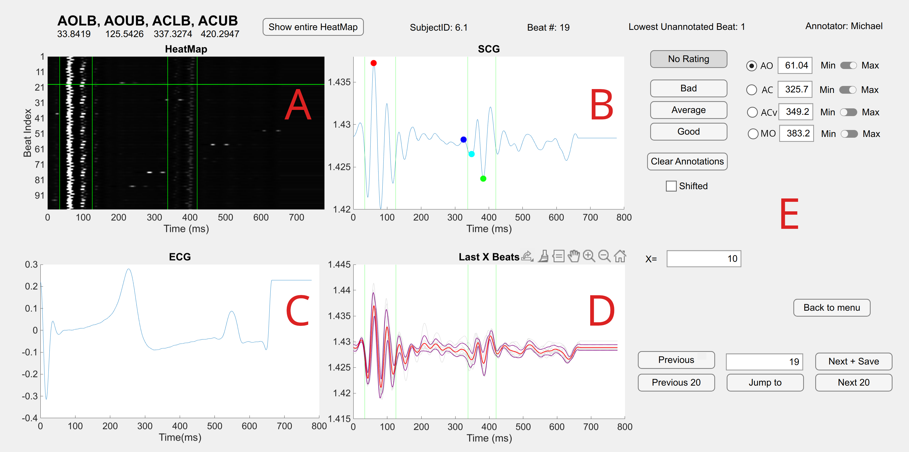

# SCG-PHD Annotation GUI in MATLAB

This repository contains the source code for the "SCG Annotation GUI," a graphical user interface developed in MATLAB App Designer. This tool is designed for the efficient and accurate manual annotation of fiducial points and signal quality in seismocardiography (SCG) signals.

This GUI was developed as part of the research project: SCG-PHD: Expert-Annotated Seismocardiography Pig Hypovolemia Dataset for Signal Quality Indexing and Validating Cardiac Timings Against Catheterized Measurements.

[Link to Annotated Dataset (Zenodo)](https://doi.org/10.5281/zenodo.15642875)

## 🔍 Overview

Seismocardiography (SCG) is a non-invasive technique for monitoring cardiac mechanical function. However, the signals are often corrupted by noise, making automated analysis challenging. Expert manual annotation remains the gold standard for validating algorithms for fiducial point detection and signal quality indexing.

This GUI was created to standardize and streamline the manual annotation process. It provides a user-friendly workspace to load SCG and ECG heartbeats, visualize them, and mark key cardiac events with high precision.
Screenshot

A visual overview of the annotation workspace.

- (A) Heatmap of all SCG beats for a global view of signal morphology.

- (B) The current SCG beat for fiducial point selection (AO, AC, ACv, MO).

- (C) The corresponding ECG beat to provide temporal context.

- (D) A running average of the last few SCG beats to aid in identifying consistent features.

- (E) The main control panel for rating signal quality, navigation, and viewing annotation data.

## ⭐ Features

- **Interactive Visualization:** Simultaneously view SCG, ECG, and a global heatmap of all beats.

- **Fiducial Point Annotation:** Mark four key fiducial points:
  
  - 🔴 Aortic Opening (AO)
  
  - 🔵 Aortic Closing (AC)
  
  - 🟣 Aortic Closing valley (ACv)
  
  - 🟢 Mitral Opening (MO)

- **Signal Quality Indexing (SQI):** Rate each beat on a three-point scale: "Good," "Average," or "Bad."

- **Efficient Navigation:** Easily move between heartbeats, jump to a specific beat, or navigate in batches.

- **Dynamic Averaging:** View a local average of recent beats to help identify stable morphological features.

- **Data Management:** Start a new annotation file, resume a previous session, or review a completed file.

- **Save & Export:** All annotations are saved to a .mat file for further analysis.

## ✅ Requirements

MATLAB R2022b or later.

## 🔀 Workflow

  - Launch the GUI: Run the .mlapp file.

  - Load Data: On the landing page, enter the annotator's name, sampling rate (Hz), and input .mat file containing the segmented heartbeats. Choose whether to start a new annotation, continue an existing one, or review a finished one.

  - Set Complex Boundaries: (A) to define the expected time ranges for the Aortic Opening (AO) and Aortic Closing (AC) complexes. These will appear as vertical green bands across all plots.

  - Annotate Beats:

    - For the current SCG beat shown in the main plot (B), use the mouse to click on the locations of the four fiducial points (AO, AC, ACv, MO). Your selections will appear as colored circles.
  
    - Use the corresponding ECG waveform (C) and the local average plot (D) as references to improve accuracy.

  - Rate Signal Quality: In the control panel (E), select a Signal Quality Index ("Good", "Average", or "Bad") for the current beat.

  - Navigate: Use the "Next" and "Previous" buttons to move one beat at a time, or use the "Next 20" / "Previous 20" buttons for faster navigation.

  - Save Progress: The application automatically saves your progress as you annotate. When you close the GUI, the final .mat file will be stored.

## 📈 Data Format
Input Data

The GUI expects a .mat file containing the following variables:

    scg_beats: A matrix where each row is a segmented SCG heartbeat.

    ecg_beats: A matrix where each row is a segmented ECG heartbeat, temporally aligned with the SCG beats.

## 📀 Output Data

The GUI saves a .mat file containing a structure or table with the following information for each beat:

    Annotator ID

    Timestamps (in milliseconds or sample index) for AO, AC, ACv, and MO.

    The assigned SQI rating (e.g., 2 for Good, 1 for Average, 0 for Bad).

    Any additional metadata, such as flags for shifted beats.

## 📝 Acknowledgements

This GUI was developed by the researchers at the Inan Research Lab, Georgia Institute of Technology.

    [1] M. Cho, “SCG-PHD: Seismocardiography Pig Hypovolemia Dataset for Signal Quality Indexing and Validated Cardiac Timings”. Zenodo, Jun. 11, 2025. doi: 10.5281/zenodo.15642875.

